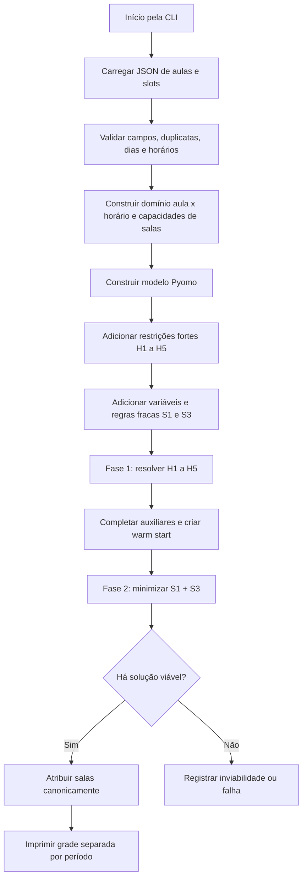

# OT1 — Otimização dos Horários da Engenharia de Computação

Trabalho da disciplina de Otimização I do CEFET-MG Campus Timóteo. O projeto formula e resolve,
com Python e Pyomo, um modelo de Programação Linear Inteira Mista para alocar aulas, salas e
horários sem conflitos.

## Estado atual

O fluxo principal já contém:

- leitura, validação e pré-processamento dos dois JSONs;
- domínio de decisão esparso, contendo apenas salas compatíveis e slots disponíveis;
- restrições fortes H1, H2, H3, H4 e H5;
- restrições fracas S1, para minimizar janelas, e S3, para balancear a semana;
- resolução com GLPK ou HiGHS;
- logging, heartbeat durante a otimização, limite opcional de tempo e tratamento de exceções;
- impressão da grade separada por período, com uma visualização adicional por sala;
- testes automatizados do carregamento, das restrições e do relatório.

O `Notebook.ipynb` e o material de apresentação ainda precisam ser consolidados para a entrega.

## Fluxo do algoritmo



### 1. Carregamento e validação

O módulo `data_loader.py` recebe:

- `disciplinas_professores_ec.json`: disciplina, professor, tipo de ambiente, período, carga
  semanal e subturma opcional;
- `salas_horarios_disponiveis_somente_37_39_labs.json`: salas e laboratórios disponíveis em cada
  dia e módulo.

Antes da modelagem, são verificados:

- presença e tipo dos campos obrigatórios;
- carga semanal inteira e positiva;
- dias e horários reconhecidos;
- slots duplicados;
- tipos conflitantes para uma mesma sala;
- existência de salas compatíveis com cada tipo de aula.

Erros dessa etapa são encapsulados em `ErroCarregamentoDados`, mantendo a exceção original
disponível para o stack trace.

### 2. Pré-processamento e decomposição de salas

A decisão otimizada pelo PLIM é:

```text
y[aula, dia, horário] = 1 se a aula ocorrer nesse horário
```

Uma chave só entra em `Y_DOMINIO` quando existe ao menos uma sala disponível da categoria exigida
pela aula. O carregamento também calcula quantas salas de cada categoria estão livres em cada
horário.

As salas físicas não participam da árvore de branch-and-bound. Depois da solução, as aulas ativas
são ordenadas e associadas às salas livres também ordenadas. Essa decomposição é exata neste
problema porque uma aula aceita qualquer sala disponível da sua categoria. Além de reduzir as
variáveis, a atribuição canônica elimina soluções equivalentes obtidas apenas pela troca de salas.

### 3. Restrições fortes

| Regra | Objetivo | Formulação resumida |
|---|---|---|
| H1 | Cumprir a carga semanal | `Σ_(dia,horário) y[aula,...] = carga[aula]` |
| H2 | Uma ocorrência por aula e horário | implícita: existe uma única variável binária `y[aula,dia,horário]` |
| H3 | Respeitar as salas livres | `Σ_(aulas do tipo) y[aula,dia,horário] ≤ capacidade[tipo,dia,horário]` |
| H4 | Evitar conflito de professor | um professor não pode ocupar duas aulas no mesmo horário |
| H5 | Evitar conflito de período | aulas do mesmo período não podem coincidir, exceto G1 × G2 |

A H3 agregada é equivalente às antigas restrições por sala porque todas as aulas de uma categoria
podem usar qualquer sala livre dessa categoria. A alocação física posterior garante que cada sala
receba no máximo uma aula.

### 4. Restrições fracas

As restrições fracas não tornam o modelo inviável. Elas criam penalidades minimizadas pela função
objetivo.

#### S1 — Janelas por período

Para cada período, dia e horário, o modelo identifica:

- se existe aula naquele horário;
- se existe alguma aula antes;
- se existe alguma aula depois;
- se o horário vazio está entre aulas e deve ser contabilizado como janela.

```text
S1 = total de horários vazios entre a primeira e a última aula do dia
```

#### S3 — Balanceamento semanal

O modelo conta os horários ocupados por período em cada dia, calcula a média diária da semana e
penaliza o desvio absoluto:

```text
S3 = Σ_periodo Σ_dia |aulas_dia - média_semanal|
```

O valor absoluto é linearizado com uma variável não negativa e duas restrições: uma para o desvio
acima da média e outra para o desvio abaixo. Cargas diárias e semanais são variáveis auxiliares
explícitas, evitando repetir expressões densas. A formulação é multiplicada por cinco para eliminar
coeficientes fracionários sem alterar o valor da penalidade.

### 5. Função objetivo

```text
min Z = peso_s1 × S1 + peso_s3 × S3
```

Os dois pesos possuem valor padrão `1.0` e podem ser alterados ao construir o modelo. As restrições
fortes permanecem obrigatórias, independentemente dos pesos escolhidos.

### 6. Resolução e relatório

O CLI resolve primeiro apenas H1--H5. Normalmente essa fase produz uma grade válida em menos de um
segundo. Os indicadores de S1/S3 são calculados e a grade é enviada ao solver completo como
`warm start`. Uma thread auxiliar emite heartbeats enquanto cada chamada bloqueante está ativa.

Se o limite de tempo for atingido, o melhor incumbente viável é carregado, recebe salas físicas e é
impresso normalmente, acompanhado de um aviso de que a otimalidade não foi comprovada. Somente a
ausência total de solução ou a inviabilidade impede a geração do relatório.

Cada célula da grade informa:

```text
Disciplina (subturma) [Professor] — Sala
```

Os erros de carregamento, construção, solver e relatório são tratados separadamente. A causa
original é preservada para que o logging mostre o stack trace completo.

## Pré-requisitos

- Python 3.12;
- dependências de `requirements.txt`;
- HiGHS, instalado pelo pacote `highspy`, ou GLPK disponível no `PATH`.

## Preparação do ambiente

No PowerShell, a partir da raiz do projeto:

```powershell
py -3.12 -m venv venv
& .\venv\Scripts\Activate.ps1
python -m pip install --upgrade pip
python -m pip install -r requirements.txt
$env:PYTHONPATH = "$PWD\src"
```

## Executar o modelo

Com HiGHS:

```powershell
& .\venv\Scripts\python.exe -m horarios_ec --solver appsi_highs
```

Com GLPK:

```powershell
& .\venv\Scripts\python.exe -m horarios_ec --solver glpk
```

### Execução com diagnóstico detalhado

```powershell
& .\venv\Scripts\python.exe -m horarios_ec `
    --solver appsi_highs `
    --solver-tee `
    --log-level DEBUG `
    --log-interval 15 `
    --time-limit 300 `
    --threads 6 `
    --mip-gap 0.01
```

Opções disponíveis:

| Opção | Descrição |
|---|---|
| `--solver` | Seleciona o solver Pyomo. |
| `--solver-tee` | Exibe o log nativo do solver. |
| `--log-level` | Define `DEBUG`, `INFO`, `WARNING` ou `ERROR`. |
| `--log-interval` | Intervalo, em segundos, entre os heartbeats. |
| `--time-limit` | Limite opcional de execução do solver, em segundos. |
| `--threads` | Quantidade de threads do HiGHS; `0` usa seleção automática. |
| `--no-parallel` | Desabilita a busca MIP paralela, que fica ativa por padrão. |
| `--mip-gap` | Aceita uma solução dentro do gap relativo informado; `0.01` equivale a 1%. |

Sem `--time-limit`, o solver continuará até terminar ou até ser interrompido com `Ctrl+C`.

### Otimizações de desempenho

O modelo reduz o trabalho do solver por meio destas estratégias:

1. H5 é agregada por período, subturma e horário, em vez de criar uma restrição para cada par de
   aulas conflitantes;
2. a decisão principal usa aula × horário; a sala física é atribuída depois;
3. H3 usa capacidade por categoria de sala, em vez de uma variável para cada sala equivalente;
4. a atribuição ordenada de salas elimina permutações simétricas;
5. a resolução em duas fases fornece um `warm start` viável ao problema completo;
6. S3 reutiliza variáveis de carga diária e semanal em uma matriz mais esparsa;
7. instâncias triviais de H3, H4 e H5 são omitidas;
8. o Big-M da ocupação usada por S1 é limitado pelo número máximo de subturmas paralelas;
9. indicadores auxiliares determinados por variáveis binárias usam domínio contínuo `[0,1]`,
   reduzindo o número de variáveis inteiras.

#### H5 agregada por grupo de conflito

Na formulação anterior, a H5 criava uma restrição para cada par de aulas conflitantes. Para três
aulas `A`, `B` e `C` do mesmo grupo, eram necessárias:

```text
A + B <= 1
A + C <= 1
B + C <= 1
```

Como as variáveis são binárias, essas três desigualdades são equivalentes a uma única restrição:

```text
A + B + C <= 1
```

Em geral, `n` aulas conflitantes exigiam `n * (n - 1) / 2` restrições par a par. A forma agregada
precisa de apenas uma restrição para cada combinação de período, grupo de conflito, dia e horário.

A agregação também preserva o paralelismo permitido entre subturmas. Considere uma aula da turma
completa e duas aulas separadas para `G1` e `G2`. O modelo cria:

```text
Turma completa + Aula G1 <= 1
Turma completa + Aula G2 <= 1
```

Assim, `G1` e `G2` podem ter aulas simultâneas, mas uma aula da turma completa não pode coincidir
com nenhuma delas. Uma aula geral é incluída em todos os grupos de conflito do período, enquanto
uma aula de subturma entra somente no próprio grupo. Quando o período não possui subturmas, todas
as suas aulas pertencem a um único grupo de conflito.

Essa alteração reduziu a H5 de `17.222` para `1.200` restrições sem mudar o conjunto de grades
válidas.

#### Decomposição e quebra de simetria das salas

Na formulação anterior, cada alternativa de sala criava uma variável
`x[aula,dia,horário,sala]`. Salas da mesma categoria geravam várias soluções equivalentes: trocar
as salas 37 e 39 não alterava o horário acadêmico, mas criava outro ponto na árvore de busca.

Agora o solver decide apenas `y[aula,dia,horário]`. Para cada categoria e horário, H3 limita a soma
das aulas pela quantidade de salas livres. Depois, aulas e salas são ordenadas e associadas uma a
uma. Como a compatibilidade depende somente da categoria, a capacidade agregada é suficiente para
garantir que essa atribuição sempre exista.

H2 tornou-se estrutural: há somente uma variável binária para cada aula e horário, portanto a mesma
aula não pode selecionar duas salas simultaneamente. Restrições de capacidade ou conflito que não
podem ser violadas também deixam de ser materializadas.

#### S3 esparsa

A formulação anterior expandia a média semanal dentro de cada restrição de desvio. Agora são usadas
variáveis auxiliares para `carga_dia` e `carga_semana`. As duas desigualdades de valor absoluto são
multiplicadas por cinco:

```text
5 * desvio >= 5 * carga_dia - carga_semana
5 * desvio >= carga_semana - 5 * carga_dia
```

Isso preserva `desvio = |carga_dia - carga_semana/5|`, evita coeficientes fracionários e diminui a
repetição de termos na matriz.

#### Solução inicial e limite de tempo

Na fase 1, S1 e S3 são temporariamente desativadas e H1--H5 produzem uma grade válida. Na fase 2,
as variáveis auxiliares são preenchidas e essa grade é enviada ao HiGHS como `MIP start`. Se o
limite acabar, o melhor incumbente é utilizado mesmo sem prova de otimalidade.

No conjunto atual, o modelo completo caiu de `13.226` para `8.166` variáveis, de `10.626` para
`5.506` binárias e de `16.859` para `12.665` restrições. A matriz passou de aproximadamente
`100.548` para `51.688` coeficientes não nulos. Em uma execução de 30 segundos, a fase de
viabilidade levou `0,43s` e o objetivo melhorou de `234,6` para `76,8`.

O paralelismo é configurado no HiGHS, onde ocorre a busca custosa. O pré-processamento Python
permanece sequencial porque sua duração é pequena e threads Python adicionariam overhead e
contenção pelo GIL.

### Códigos de saída

| Código | Significado |
|---:|---|
| 0 | Fluxo concluído com solução viável, ótima ou incumbente do limite de tempo. |
| 1 | Solver indisponível. |
| 2 | Nenhuma solução viável encontrada ou modelo classificado como inviável. |
| 3 | Falha no carregamento ou validação dos dados. |
| 4 | Falha na construção do modelo. |
| 5 | Falha ao inicializar ou consultar o solver. |
| 6 | Falha durante o solver ou ao carregar a solução. |
| 7 | Falha ao gerar o relatório. |
| 99 | Falha inesperada não tratada pelas etapas anteriores. |
| 130 | Execução interrompida pelo usuário. |

## Testes

Executar toda a suíte:

```powershell
& .\venv\Scripts\python.exe -m pytest -q
```

Validar também a compilação dos módulos:

```powershell
& .\venv\Scripts\python.exe -m compileall -q src utils tests
```

## Estrutura do repositório

```text
data/raw/                       JSONs originais
docs/planejamento.md            decisões e plano de execução
docs/referencias/               enunciado do trabalho
src/horarios_ec/
  __main__.py                   CLI, logging, solver e tratamento do fluxo
  data_loader.py                leitura, validação e domínio esparso
  exceptions.py                 exceções específicas das etapas
  model_builder.py              construção do modelo Pyomo
  reporting.py                  grades por período e por sala
utils/
  restricoes.py                 regras fortes H1 a H5
  restricoes_fracas.py          regras auxiliares de S1 e S3
  solucao.py                    warm start e atribuição canônica de salas
tests/test_horarios.py          testes automatizados
outputs/                        relatórios gerados localmente
Notebook.ipynb                  entrega principal em notebook
requirements.txt               dependências Python
```

## Próximas etapas

1. Consolidar a implementação e as explicações no `Notebook.ipynb`.
2. Avaliar pesos diferentes para S1 e S3 e registrar seus impactos.
3. Executar o modelo completo com tempo adequado e analisar a qualidade da solução.
4. Exportar os resultados finais e preparar o `Slide.pdf`.
